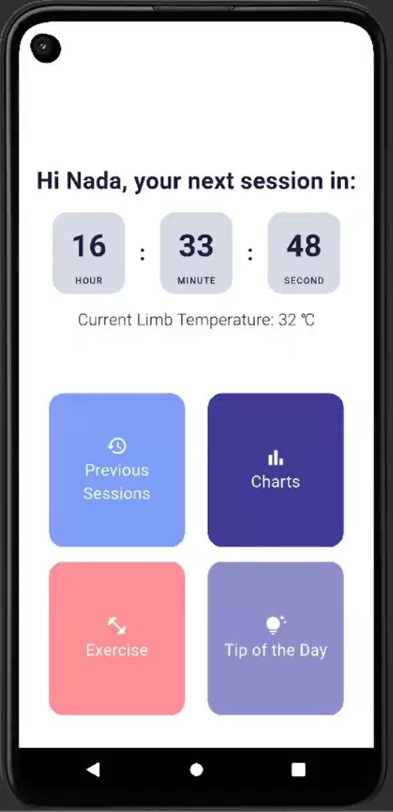

# 🩺 Smart Rehab Band – Personalized Therapy for Neuropathy & Circulation Issues

A wearable rehabilitation system designed for patients with **neuropathy** and **poor circulation**. The device integrates biometric sensing and AI-powered therapy recommendations to deliver **personalized vibration sessions**, improving comfort, mobility, and blood flow. The companion mobile app helps users track progress, stay engaged with exercises, and understand their recovery journey.

## 📦 Features

### ✅ Personalized Vibration Therapy
- Connects to **MediSearch API** for intelligent therapy recommendations
- Inputs include:
  - **Limb temperature** (measured by wearable)
  - **Heart rate** (measured by wearable)
  - **Pain level** (entered manually)
  - **Numbness level** (entered manually)
- When it's time for a session:
  - The system fetches recommended **frequency**, **duration**, and **medical justification**
  - Patient can **accept or modify** settings before starting

### ⏳ Next Session Countdown
- Home screen features a **"Your next session in:"** timer
- Helps patients stay on schedule with therapy sessions

### 📊 Symptom Progress Tracker
- View trends in:
  - Pain level
  - Numbness level
  - Limb Temperature
- Easy-to-read charts updated daily

### 📽️ Daily Circulation Exercises
- One **exercise video per day** to promote healthy circulation
- Simple routines tailored for neuropathy-friendly movement

### 💡 Health Tips
- **Daily health tip** related to circulation, nerve health, or pain management

### 🧾 Session History
- Tappable list of past sessions
- Opens a dialog showing:
  - Date and time
  - Duration
  - Vibration frequency
  - User-reported symptoms at session time

## 🧠 How It Works

1. **User wears the band**, which continuously measures:
   - Limb **temperature**
   - **Heart rate**
2. When the countdown reaches zero:
   - A dialog appears prompting the user to enter **pain** and **numbness** levels
3. These values + sensor data are sent to the **MediSearch API**
4. The API returns a **recommended session plan** (frequency + duration + justification)
5. User reviews and optionally modifies the settings
6. The session begins with **custom vibration output**
7. All data is stored and visualized for progress tracking

## 📄 License

This project is licensed under the GPL v3 License - see the `LICENSE` file for details.

## Authors

  
  
  
  

